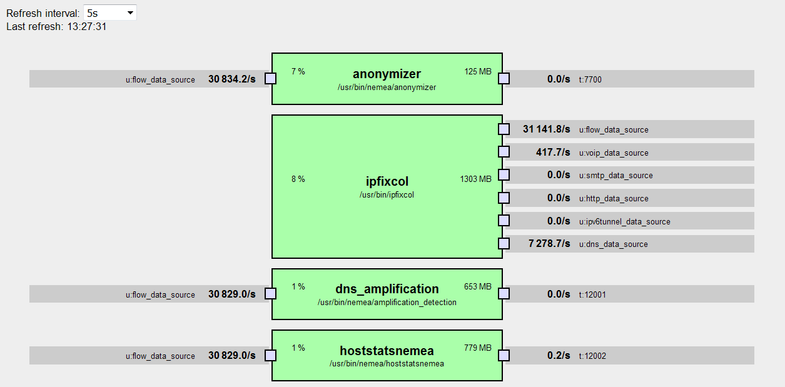

# Nemea Status web

Simple web frontend showing current set of Nemea modules and several statisics - counters of messages transferred over IFCs and CPU and memory consupmption of each module.

The web is written in Python-Flask. It gets data from Nemea Supervisor running on the same machine.



## Requirements

- Nemea Supervisor 1.4.3 or later
- Python 3.x or Python 2.6+
- Flask


## Installation/deployment

For testing, just run `nemea_status.py`, it creates a simple web server listening on port 5000.

For production, configure your web server to load WSGI script `wsgi.py`. How to do this depends on your server and its configuration.

For Apache, the following should probably work (if not, consult documentation of your web server and/or find some WSGI tutorial):
- Install mod_wsgi.
- Copy `nemea_status` directory to a path where web pages are usally stored in your system, e.g. `/var/www/html`
- Add this to your `/etc/httpd/conf/httpd.conf` (change paths if neccessary):
```
# Point /nemea_status to the WSGI script
WSGIScriptAlias /nemea_status /var/www/html/nemea_status/wsgi.py
WSGIPythonPath /var/www/html/nemea_status

# Static files should be served directly by Apache
Alias /nemea_status/static/ /var/www/html/nemea_status/static/
```
- Don't forget to add some kind of access control, so the page is not accessible to anyone.
